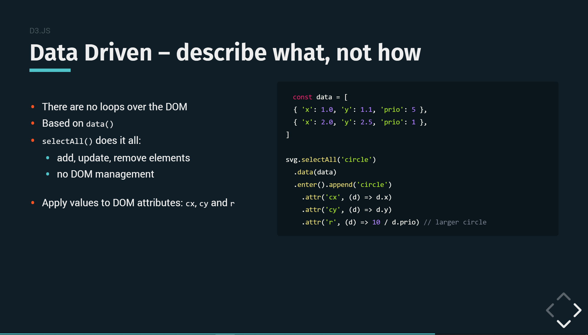

# tidy-revealjs

A custom theme and build system for reveal.js

I love [reveal.js](https://github.com/hakimel/reveal.js) for its ability to let me do slide with code directly in the browser and with [markdown](https://github.com/hakimel/reveal.js/#markdown). Theming and slide management is however tricky. Moving slides means navigating yourself in a potentially large and nested DOM tree.

_**What if instead you just wrote markdown and the slides were automatically generated for you?**_ How? Continue to ["slides via file structure"](#slides-via-file-structure)

### Preview

- [This demo repository &rarr;](https://julie-ng.github.io/tidy-revealjs/)
- [WorkerConf 2019 - Visualizing cloud architectures in real time with d3.js &rarr;](https://github.com/julie-ng/newtonjs-talk-slides)

This [WorkerConf slide](https://github.com/julie-ng/newtonjs-talk-slides) was created using just markdown:

[](https://github.com/julie-ng/newtonjs-talk-slides/#/5/2)

## Usage

First, clone this repository

```
git clone https://github.com/julie-ng/tidy-revealjs
```

Then install dependencies, including reveal.js

```
npm install
```

Then start development server including live-reload while you work on your slides:

```
npm run dev
```

A browser window will automatically open [http://localhost:3000/](http://localhost:3000/)

### Config and Handlebars

Inside `slides.config.js`, you can define variables to use your Handlebars template, for example:

```
module.exports = {
	title: 'tidy-revealjs demo'
}
```

and then you can use `{{ title }}` in handlebars.

## Slides via File Structure  

When it comes to content, there is no `index.html` with slides. Instead, you create files inside the `slides` folder, which are loaded in alphabetical order.

### How to re-order slides

- slide order is determined by alphabetical order
- subfolders are interpreted as [vertical slides](https://github.com/hakimel/reveal.js/#vertical-slide-navigation)

Here is an example file structure for `slides/`

```
./slides
├── 1.html
├── 2.md
├── 3.md
└── base
    ├── bulleted-lists.md
    ├── ordered-lists.md
    ├── tables-as-html.html
    └── tables.md
```

The easiest way to manage order of your slides is to **prepend the filenames with numbers**, for example:

```
├── 1-title.html
├── 20.md
├── 30-point-of-view.md
├── 40-markdown-support.html
```

Tip: consider numbering your slides, e.g. 10, 20, 30… so you can insert and move content easily.

## Slide Types: HTML vs Markdown

- **HTML Slides** must have `<section>` as root element.
- **Markdown Slides** have the `.md` extension.

### Speaker Notes

This template supports the same syntax for notes as in reveal js. When running in development mode, press `s` key on your keyboard to open up the [speaker mode](https://github.com/hakimel/reveal.js#speaker-notes).

In HTML, include an `<aside>` element at the end of your `<section>`

```
<aside class="notes">
  <ul>
    <li>Note one</li>
    <li>Note two</li>
    <li>Note three</li>
  </ul>
</aside>
```

Or in Markdown, everything after `Note:` is processed as a speaker note

```
Note:
This is a note
  - with a list
  - another list item
```

For further examples of how to use this, please review my [WorkerConf slides &rarr;](https://github.com/julie-ng/newtonjs-talk-slides)

## Todo

- Setup generator?
  - Better for re-use than cloning this repository
  - Better for versioning [gulpfile.js](./gulpfile.js) that does the magic
- Specify "build" folder? Currently this builds to root project directory, so I could publish slides via `master` branch on GitHub pages. Might be confusing for others, who want to publish elsewhere.
- Clean up and test theme?

## Credits

This is just a template with some automation for creating slides. The heavy-lifting and presentation framework itself is [reveal.js](https://github.com/hakimel/reveal.js) and all credit goes to [Hakim El Hattab](https://github.com/hakimel) 👏

### Photos
- _Furniture, Desk, Chair and Table_ by [Minh Pham](https://unsplash.com/@minhphamdesign) on [Unsplash](https://unsplash.com/)
- _Stack_ by [STIL](https://unsplash.com/@stilclassics) on [Unsplash](https://unsplash.com/)

